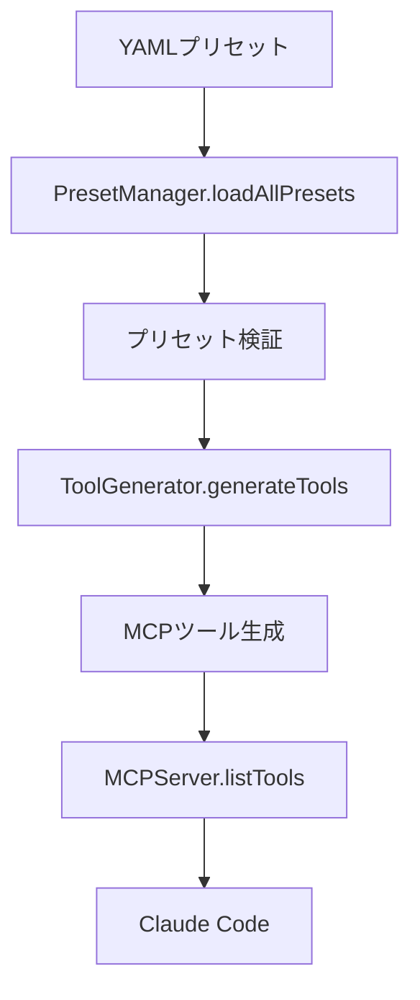

# ツール登録・リビルドガイド

## 📋 概要

SD WebUI Reforge MCP サーバーは、YAMLプリセットファイルからMCPツールを動的に生成します。このガイドでは、プリセットからツール生成、リビルド、Claude Code への登録までの完全なプロセスを説明します。

## 🔄 ツール生成フロー

### 1. 全体アーキテクチャ

```
YAML プリセット → PresetManager → ToolGenerator → MCPServer → Claude Code
    ↓               ↓              ↓             ↓           ↓
プリセット定義    YAML解析      ツール生成    MCP応答     ユーザー利用
```

### 2. 詳細フロー



## 🛠️ ツール生成プロセス

### PresetManager による YAML 解析

**ファイル**: `src/presets/manager.ts`

```typescript
// プリセット読み込み
loadAllPresets(): Preset[] {
  // 1. presetsディレクトリをスキャン
  // 2. .yaml/.ymlファイルを検出
  // 3. template/placeholderファイルを除外
  // 4. 各プリセットを解析・検証
  // 5. 有効なプリセットのリストを返す
}
```

**処理ルール**:
- `presets/` ディレクトリ内の `.yaml`, `.yml` ファイルを自動検出
- ファイル名に `template`, `placeholder` を含むファイルは除外
- 隠しファイル（`.` で始まる）は除外
- プリセット構造の検証を実行

### ToolGenerator による MCP ツール生成

**ファイル**: `src/server/tool-generator.ts`

```typescript
// ツール生成メイン処理
generateTools(): MCPTool[] {
  // 1. 全プリセットを取得
  // 2. 各プリセットをMCPツールに変換
  // 3. ツールリストを返す
}
```

#### ツール命名規則

```
MCPツール名 = "sdreforge_" + プリセット名
```

**例**:
- `01_txt2img_dynamic.yaml` → `sdreforge_txt2img_dynamic`
- `07_utility_png_info.yaml` → `sdreforge_utility_png_info`

#### 必須パラメータ決定ロジック

```typescript
switch (preset.type) {
  case 'txt2img':
    required = ['prompt'];
    break;
  case 'img2img':
    required = ['prompt', 'init_image'];
    break;
  case 'extras':
  case 'extras_combined':
  case 'png-info':
  case 'tagger':
    required = ['image'];
    break;
  case 'utility':
    required = []; // ユーティリティは必須パラメータなし
    break;
}
```

### 動的パラメータ生成

#### ControlNet パラメータ生成

```typescript
// max_units に基づく動的生成
const maxControlnetUnits = preset.extensions?.controlnet?.max_units || 3;

for (let i = 1; i <= maxControlnetUnits; i++) {
  // 画像パラメータ
  const paramName = i === 1 ? 'controlnet_image' : `controlnet_image_${i}`;

  // 有効化パラメータ
  schema[`controlnet_enable_${i}`] = {
    type: 'boolean',
    description: `Enable ControlNet Unit ${i-1}`,
    default: false
  };

  // モデルパラメータ
  schema[`controlnet_model_${i}`] = {
    type: 'string',
    description: `ControlNet model for Unit ${i-1}`
  };

  // その他のパラメータ...
}
```

**生成されるパラメータ例** (`max_units: 3` の場合):
- `controlnet_image`, `controlnet_image_2`, `controlnet_image_3`
- `controlnet_enable_1`, `controlnet_enable_2`, `controlnet_enable_3`
- `controlnet_model_1`, `controlnet_model_2`, `controlnet_model_3`
- `controlnet_module_1`, `controlnet_module_2`, `controlnet_module_3`
- `controlnet_weight_1`, `controlnet_weight_2`, `controlnet_weight_3`

#### ADetailer パラメータ生成

```typescript
// max_models に基づく動的生成
const maxAdetailerModels = preset.extensions?.adetailer?.max_models || 2;

for (let i = 1; i <= maxAdetailerModels; i++) {
  schema[`adetailer_model_${i}`] = {
    type: 'string',
    description: `ADetailer model ${i}`,
    ...(i === 1 ? { default: 'face_yolov8n.pt' } : {})
  };
}
```

**生成されるパラメータ例** (`max_models: 15` の場合):
- `adetailer_model_1`, `adetailer_model_2`, ..., `adetailer_model_15`

### MCPServer によるリクエスト処理

**ファイル**: `src/server/mcp-server.ts`

```typescript
// MCP リクエスト処理
async callTool(request: CallToolRequest): Promise<CallToolResult> {
  // 1. ツール名からプリセット名を抽出
  // 2. プリセットを読み込み
  // 3. ユーザーパラメータとマージ
  // 4. API ペイロード生成
  // 5. SD WebUI Reforge API 呼び出し
  // 6. 結果をMCP形式で返却
}
```

#### 自動有効化ロジック

**ControlNet 自動有効化**:
```typescript
// 後方互換性のための自動有効化
const enableFlagSet = params[config.enableParam] !== undefined;
const hasImage = !!params[config.imageParam];

if (enableFlagSet) {
  isEnabled = params[config.enableParam] === true && hasImage;
} else if (hasImage) {
  isEnabled = true; // 画像が提供された場合は自動有効化
}
```

**ADetailer 自動有効化**:
```typescript
// Model 1: デフォルト有効
// Model 2以降: adetailer_model_X が指定された場合のみ有効
const shouldEnable = (i === 1) || userParams[`adetailer_model_${i}`];
```

## 📁 ファイル構造とパス

### プリセットディレクトリ構造

```
sdreforge_mcp/
├── presets/                    # アクティブプリセット
│   ├── 01_txt2img_dynamic.yaml
│   ├── 02_img2img_dynamic.yaml
│   ├── 03_extras_upscale_dynamic.yaml
│   ├── ...
│   ├── deprecated/             # 非推奨プリセット
│   │   ├── 01_txt2img_animagine_base.yaml
│   │   └── ...
│   └── templates/              # テンプレート（除外される）
│       ├── FULL_TEMPLATE_txt2img.yaml
│       └── ...
```

### 処理対象ファイル判定

```typescript
// 処理対象判定ロジック
for (const file of files) {
  // 1. YAML拡張子チェック
  if (!file.endsWith('.yaml') && !file.endsWith('.yml')) {
    continue;
  }

  // 2. 隠しファイル除外
  if (file.startsWith('.')) {
    continue;
  }

  // 3. テンプレート・プレースホルダー除外
  if (file.includes('template') || file.includes('placeholder')) {
    continue;
  }

  // 4. プリセット処理
  const preset = this.loadPreset(file);
  presets.push(preset);
}
```

## 🔄 リビルド・再起動プロセス

### 1. プリセット変更後のリビルド

```bash
# TypeScript コンパイル
npm run build

# または開発モード（ホットリロード）
npm run dev
```

### 2. Claude Code 再起動

**Windows**:
```bash
# Claude Code を完全終了
taskkill /f /im "Claude.exe"

# 再起動
start "" "C:\Users\{username}\AppData\Local\Programs\Claude\Claude.exe"
```

**設定確認**:
```bash
# Claude Code 設定ファイル確認
type "%APPDATA%\Claude\claude_desktop_config.json"
```

### 3. 設定ファイル (claude_desktop_config.json)

```json
{
  "mcpServers": {
    "sdreforge": {
      "command": "npx",
      "args": ["-y", "tsx", "C:\\path\\to\\sdreforge_mcp\\src\\index.ts"],
      "env": {
        "SD_WEBUI_URL": "http://localhost:7860"
      }
    }
  }
}
```

### 4. 動作確認

Claude Code で以下をテスト:
```
利用可能なツールを教えて
```

期待する出力:
- `sdreforge_txt2img_dynamic`
- `sdreforge_img2img_dynamic`
- `sdreforge_extras_upscale_dynamic`
- その他16個のツール

## 🐛 トラブルシューティング

### ツールが表示されない

**確認項目**:
1. **プリセットファイルの構文エラー**
   ```bash
   # YAML 構文確認
   npx js-yaml presets/01_txt2img_dynamic.yaml
   ```

2. **ビルドエラー**
   ```bash
   npm run build
   # エラーメッセージを確認
   ```

3. **MCPサーバー起動状況**
   ```bash
   # デバッグモードで起動
   DEBUG=true npx tsx src/index.ts
   ```

4. **Claude Code ログ確認**
   ```
   Windows: %APPDATA%\Claude\logs\
   ```

### プリセット読み込みエラー

**デバッグログ確認**:
```bash
# mcp-debug.log ファイルを確認
type mcp-debug.log
```

**一般的な問題**:
- YAML インデントエラー
- 必須フィールド不足 (`name`, `type`)
- 不正な `type` 値

### 動的パラメータが生成されない

**確認項目**:
1. **メタデータ設定**
   ```yaml
   extensions:
     controlnet:
       max_units: 3        # 必須
     adetailer:
       max_models: 15      # 必須
   ```

2. **プリセット名**
   - 動的生成は `txt2img_dynamic` と `img2img_dynamic` のみ

### SD WebUI Reforge 接続エラー

**確認項目**:
1. **SD WebUI Reforge 起動状況**
   ```bash
   curl http://localhost:7860/sdapi/v1/options
   ```

2. **API フラグ**
   ```bash
   # 起動時に --api フラグが必要
   python launch.py --api --listen
   ```

3. **環境変数**
   ```bash
   # .env.local または環境変数確認
   echo $SD_WEBUI_URL
   ```

## 📊 デバッグとログ

### デバッグモード有効化

```bash
# 環境変数でデバッグ有効化
DEBUG=true npx tsx src/index.ts
```

### ログファイル

**mcp-debug.log**:
```
[DEBUG 2025-09-21T12:00:00.000Z] Loading presets from: ./presets
[DEBUG 2025-09-21T12:00:00.001Z] Found 16 files in presets directory
[DEBUG 2025-09-21T12:00:00.002Z] Loading preset: 01_txt2img_dynamic.yaml
[DEBUG 2025-09-21T12:00:00.003Z] Successfully loaded preset: txt2img_dynamic (type: txt2img)
```

### プリセット検証

```typescript
// 検証項目
validatePreset(preset: any): boolean {
  // 1. オブジェクト型チェック
  // 2. name フィールド存在チェック
  // 3. type フィールド存在チェック
  // 4. サポートされている type かチェック
  // 5. 構造整合性チェック
}
```

## 🔧 カスタムプリセット作成フロー

### 方法1: テンプレートシステム使用（推奨）

```bash
# 1. 設定カスタマイズ
npm run setup:presets:sample          # サンプル.env生成
cp .env.sample .env                    # 設定ファイルコピー
# .envファイルを編集してデフォルト値をカスタマイズ

# 2. プリセット生成
npm run setup:presets:validate        # 設定検証
npm run setup:presets                 # プリセット自動生成

# 3. ビルド・起動
npm run build
# Claude Code 再起動
```

### 方法2: 手動プリセット作成

```bash
# 新しいプリセットファイル作成
touch presets/17_custom_preset.yaml
```

**プリセット定義:**
```yaml
name: custom_preset
type: txt2img
description: "カスタム画像生成プリセット"

base_settings:
  checkpoint: "your_model_name"
  steps: 30
  cfg_scale: 8

extensions:
  adetailer:
    enabled: true
    models:
      - model: "face_yolov8n.pt"
```

**リビルド・テスト:**
```bash
# 1. ビルド
npm run build

# 2. Claude Code 再起動

# 3. 動作確認
# Claude Code で "sdreforge_custom_preset" ツールが利用可能か確認
```

### 方法3: 既存プリセットのマイグレーション

```bash
# 1. マイグレーション分析
npm run migrate:presets:report        # 移行対象確認

# 2. プレビュー実行
npm run migrate:presets:dry-run       # 変更内容確認

# 3. 実際のマイグレーション
npm run migrate:presets               # 非推奨プリセットを整理
```

## 📚 関連ファイル

### 主要ファイル
- `src/presets/manager.ts` - プリセット管理
- `src/server/tool-generator.ts` - ツール生成
- `src/server/mcp-server.ts` - MCP サーバー
- `src/presets/types.ts` - 型定義

### 設定ファイル
- `claude_desktop_config.json` - Claude Code MCP 設定
- `.env.local` - 環境変数
- `package.json` - ビルド・開発スクリプト

## 🔗 関連ドキュメント

- [YAML プリセットリファレンス](PRESET_YAML_REFERENCE.md)
- [開発者ガイド](DEVELOPER_GUIDE.md)
- [プリセットテンプレートガイド](PRESET_TEMPLATES_GUIDE.md)